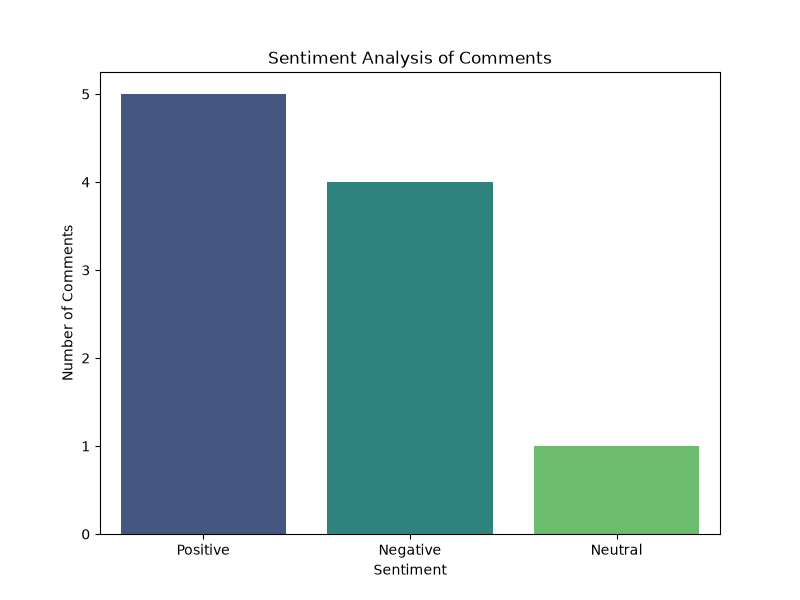

# Sentiment-Trend-Tracker

A lightweight Python-based tool designed to analyze the emotional tone of user comments and visualize the overall trend.  This project is ideal for tracking brand sentiment, analyzing product feedback, or monitoring community reactions in real-time.

## Overview

The **Sentiment Trend Tracker** takes a dataset of text comments (via CSV) and processes them using the **VADER (Valence Aware Dictionary and sEntiment Reasoner)** sentiment analysis tool. It then categorizes each comment as Positive, Negative, or Neutral and generates a visual report to make the data easy to digest at a glance.

### Project Demo

*Example output: A visualization showing the distribution of sentiments from the input dataset.*

---

## Features
- **Automated Sentiment Scoring**: Uses VADER for high-accuracy sentiment detection tailored for social media and short-form text.
- **Data Processing**: Leverages `Pandas` for efficient handling of CSV data.
- **Visual Analytics**: Generates professional bar charts using `Seaborn` and `Matplotlib`.
- **Fast Setup**: Minimal dependencies and easy deployment via Python virtual environments.

## 🛠️ Tech Stack
- **Language:** Python 3
- **Libraries:**
    - `vaderSentiment`: For the core NLP analysis.
    - `pandas`: For data manipulation.
    - `matplotlib` & `seaborn`: For data visualization.

---

## 📖 How It Works

The logic follows a simple three-step pipeline:

1. **Ingestion**: The script reads a `comments.csv` file containing a column of text.
2. **Polarity Analysis**: VADER calculates a "Compound Score" for each sentence:
   - $\text{Score} \ge 0.05 \rightarrow$ **Positive**
   - $\text{Score} \le -0.05 \rightarrow$ **Negative**
   - $\text{Between } -0.05 \text{ and } 0.05 \rightarrow$ **Neutral**
3. **Visualization**: The counts of each category are plotted into a bar chart, which is saved as `sentiment_report.png`.

---

## ⚙️ Installation & Usage

### Prerequisites
Ensure you have Python installed on your system.

### Setup
1. **Clone the repository:**

bash

git clone https://github.com/SwanOK/Sentiment-Trend-Tracker.git

cd Sentiment-Trend-Tracker

2. **Create and activate a virtual environment:**

bash

python -m venv venv

# On Linux/macOS:

source venv/bin/activate

# On Windows:

venv\Scripts\activate

3. **Install dependencies:**

bash

pip install -r requirements.txt

### Running the Project
1. Prepare your `comments.csv` file with a column named `text`.
2. Run the main script:

bash

python main.py

3. Once finished, check your folder for the generated `sentiment_report.png`.

---

## Future Roadmap
- [x] **API Integration**: Connect to the Twitter/X or Reddit API to fetch live comments.
- [ ] **Interactive Dashboard**: Use Streamlit to create a web-based UI.
- [ ] **Multi-language Support**: Integrate Google Translate API for non-English comments.

## License
Distributed under the MIT License. See `LICENSE` for more information.
